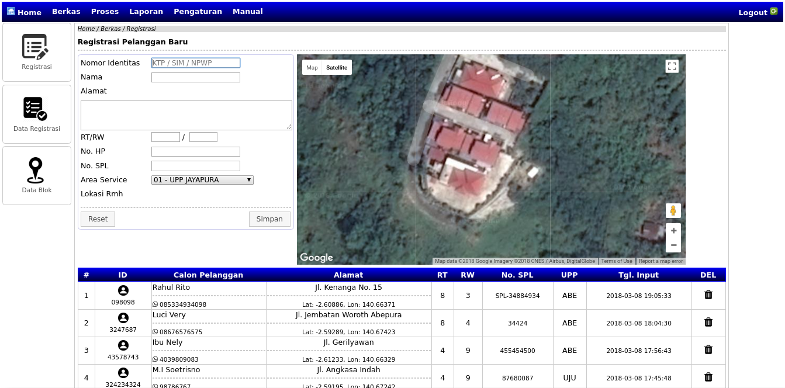

# Aplikasi E-Hublang PDAM Jayapura

## Deskripsi
Aplikasi ini adalah penyempuranaan dari aplikasi sebelumnya dengan tambahan fitur GPS Koordinat yang mempermudah petugas dalam melakukan pendataan serta survey lapangan dan untuk kelengkapan data pelanggan, baik yang baru mendaftar maupun dipersiapkan untuk penyempurnaan data pelanggan yang sudah ada, melalui aplikasi berbasis mobile yang terkoneksi dengan aplikasi induk ini.

### Progress 1
Pembuatan Proposal Penawaran
Pembuatan User Manual berbasis Video (Dalam Tahap)

## Progress 2
Integrasi sidebar ke dalam menu (navigation)
